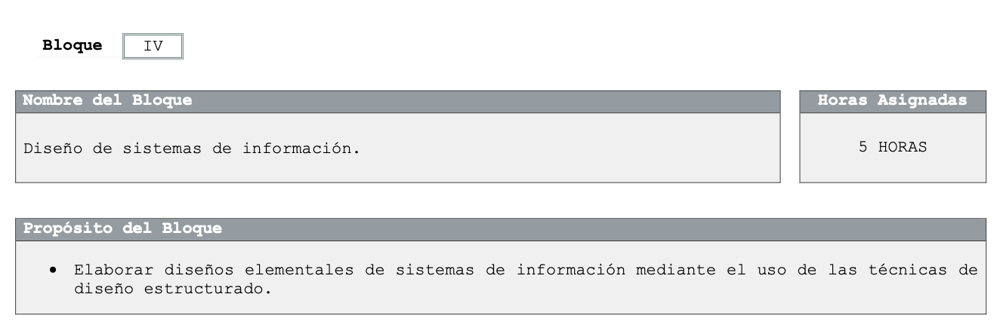

# SISTEMAS DE INFORMACIÓN
SISTEMAS DE INFORMACION PARA EL G510 Y G524

## PLAN DE TRABAJO ACADEMICO

El presente programa de estudio fue actualizado por académicos con base a los programas de estudio para la generación 2017-2020 de la Dirección General del Bachillerato (DGB) y los planes de estudio de referencia del componente básico del Marco Curricular Común de la Educación Media Superior.

